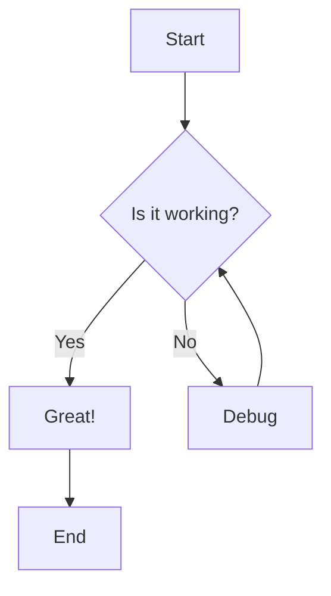
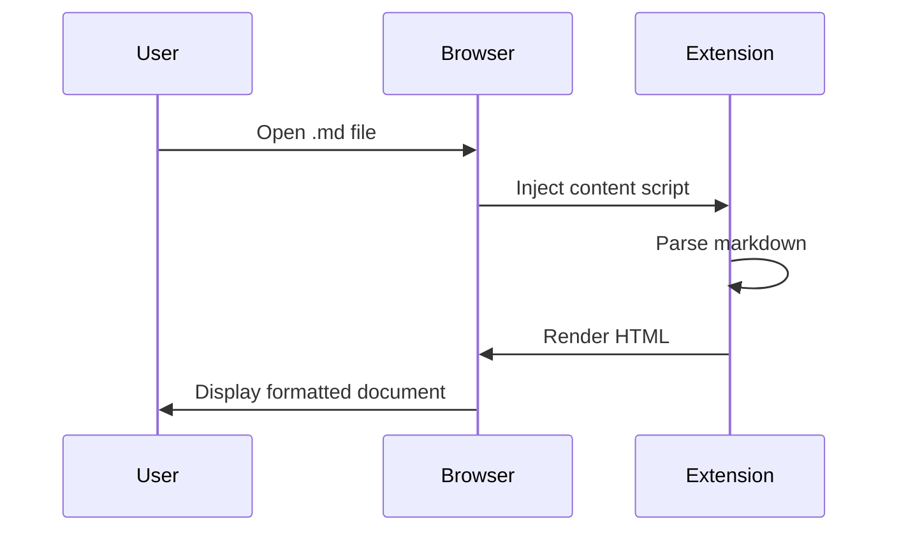
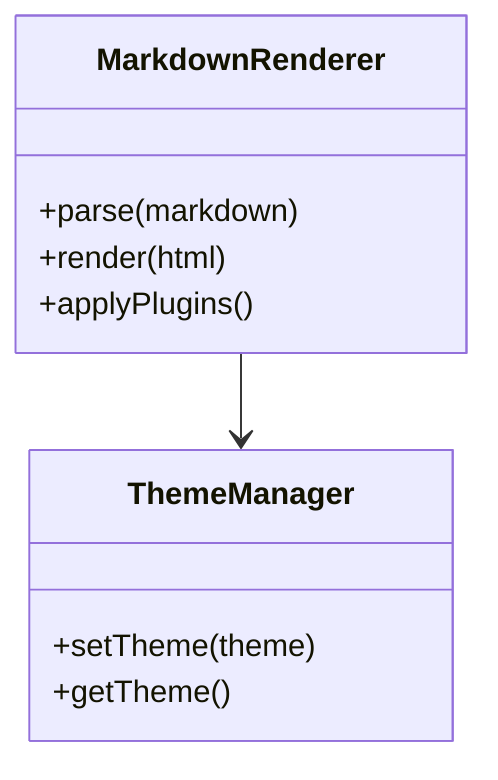

# MarkView Features Demo

Welcome to the **MarkView (Open-Source Edition)**! This document demonstrates the core rendering features available in this lightweight viewer.

---

## Table of Contents

- [Text Formatting](#text-formatting)
- [Lists](#lists)
- [Tables](#tables)
- [Code Blocks](#code-blocks)
- [Math Equations](#math-equations)
- [Mermaid Diagrams](#mermaid-diagrams)
- [GitHub Alerts](#github-alerts)
- [Extended Markdown](#extended-markdown)

---

## Text Formatting

### Basic Formatting

**Bold text** with `**bold**`
*Italic text* with `*italic*`
~~Strikethrough~~ with `~~strikethrough~~`
`Inline code` with backticks

### Links and Images

[Link to GitHub](https://github.com/markview-app/markview)


---

## Lists

### Unordered List

- Item 1
- Item 2
  - Nested item 2.1
  - Nested item 2.2
- Item 3

### Ordered List

1. First item
2. Second item
   1. Nested 2.1
   2. Nested 2.2
3. Third item

### Task List

- [x] Completed task
- [ ] Pending task
- [ ] Another pending task

---

## Tables

| Feature | Open-Source | Full (FREE) | Full (PRO) |
|---------|-------------|-------------|------------|
| Core Rendering | ✅ | ✅ | ✅ |
| Syntax Themes | 1 | 14 | 14 |
| TOC Levels | H1-H2 | H1-H3 | H1-H6 |
| HTML Export | 500 words | Unlimited | Unlimited |
| DOCX Export | ❌ | 800 words | Unlimited |

---

## Code Blocks

### JavaScript

```javascript
// Calculate fibonacci numbers
function fibonacci(n) {
  if (n <= 1) return n;
  return fibonacci(n - 1) + fibonacci(n - 2);
}

console.log(fibonacci(10)); // 55
```

### Python

```python
def greet(name):
    """Greet someone with a message"""
    return f"Hello, {name}!"

print(greet("World"))
```

### TypeScript

```typescript
interface User {
  id: number;
  name: string;
  email: string;
}

const user: User = {
  id: 1,
  name: "John Doe",
  email: "john@example.com"
};
```

---

## Math Equations

### Inline Math

The quadratic formula is $x = \frac{-b \pm \sqrt{b^2-4ac}}{2a}$

### Display Math

$$
\int_{-\infty}^{\infty} e^{-x^2} dx = \sqrt{\pi}
$$

$$
E = mc^2
$$

---

## Mermaid Diagrams

### Flowchart



### Sequence Diagram



### Class Diagram



---

## GitHub Alerts

> [!NOTE]
> This is a note alert. Useful for highlighting information.

> [!TIP]
> This is a tip alert. Great for helpful suggestions!

> [!IMPORTANT]
> This is an important alert. Use it for critical information.

> [!WARNING]
> This is a warning alert. Caution users about potential issues.

> [!CAUTION]
> This is a caution alert. For serious warnings.

---

## Extended Markdown

### Footnotes

Here's a sentence with a footnote[^1].

[^1]: This is the footnote content.

### Abbreviations

The HTML specification is maintained by the W3C.

*[HTML]: Hyper Text Markup Language
*[W3C]: World Wide Web Consortium

### Superscript and Subscript

H~2~O is water
x^2^ is x squared

### Insert and Mark

++Inserted text++ with `++text++`
==Highlighted text== with `==text==`

### Definition Lists

Term 1
:   Definition 1

Term 2
:   Definition 2a
:   Definition 2b

---

## Horizontal Rules

---

***

---

## Blockquotes

> This is a blockquote.
>
> > Nested blockquote
>
> Back to first level

---

## What's Next?

### Upgrade to Full Extension

Want more features? Check out the full MarkView extension:

- 🚀 **Auto-refresh** - Live preview while editing
- 📁 **Folder browser** - Navigate entire project structures
- 🔍 **Folder search** - Search across all markdown files
- 📊 **Advanced TOC** - Up to H6 headings with collapsible sections
- 💾 **DOCX export** - Convert to Microsoft Word format
- 📽️ **Presentation mode** - Turn markdown into slideshows
- 🌐 **12 languages** - Multi-language interface
- 🎨 **14 themes** - Syntax highlighting customization

**Install from**:

- [Chrome Web Store](https://chromewebstore.google.com/detail/cfopbpknalachedpcddhgbgjoigklien)
- [Microsoft Edge Add-ons](https://microsoftedge.microsoft.com/addons/detail/kpobglkjeapfinbaecjidahlnnohcaed)
- [Official Website](https://getmarkview.com/)

---

## Contribute

This open-source edition welcomes contributions!

- **GitHub**: [markview](https://github.com/markview-app/markview)
- **Issues**: [Report bugs](https://github.com/markview-app/markview/issues)
- **Discussions**: [Ask questions](https://github.com/markview-app/support/discussions)

---

<div align="center">

**Made with ❤️ by the MarkView Team**

[GitHub](https://github.com/markview-app) • [Website](https://getmarkview.com/) • [Support](https://github.com/markview-app/support)

</div>
